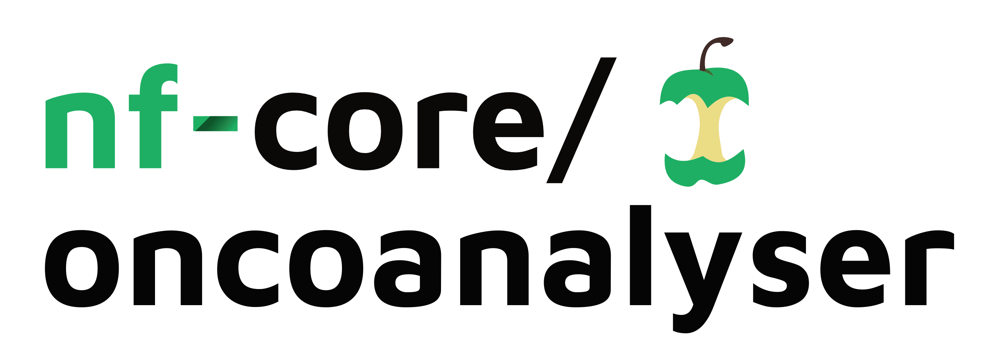
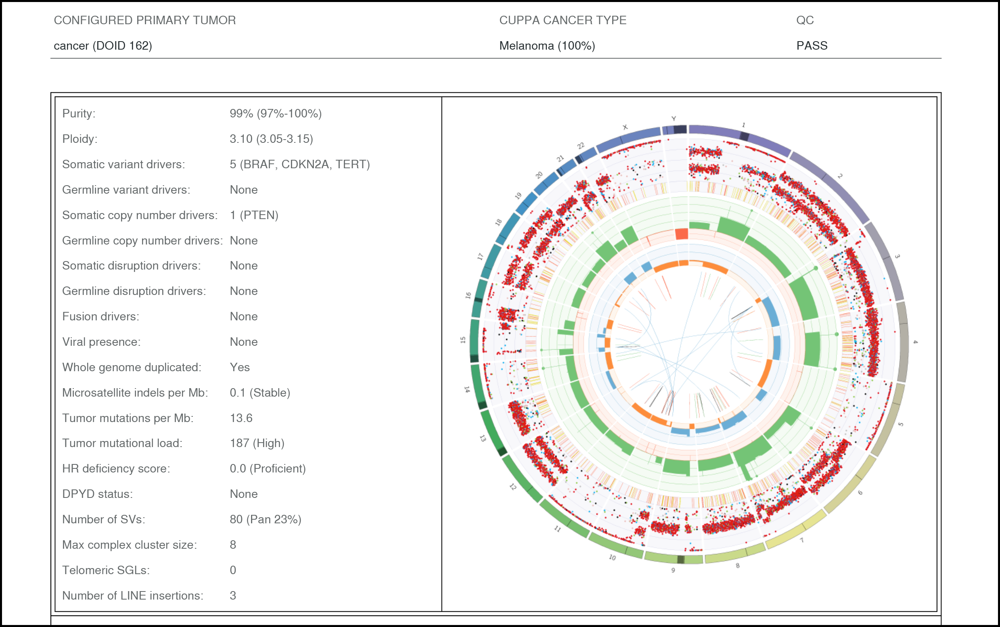

<h1>
  <picture>
    <source media="(prefers-color-scheme: dark)" srcset="docs/images/nf-core-oncoanalyser_logo_dark.png">
    
  </picture>
</h1>

[](https://github.com/nf-core/oncoanalyser/actions/workflows/ci.yml)
[](https://github.com/nf-core/oncoanalyser/actions/workflows/linting.yml)
[](https://nf-co.re/oncoanalyser/results)
[](https://doi.org/10.5281/zenodo.XXXXXXX)
[](https://www.nf-test.com)

[](https://www.nextflow.io/)
[](https://docs.conda.io/en/latest/)
[](https://www.docker.com/)
[](https://sylabs.io/docs/)
[](https://cloud.seqera.io/launch?pipeline=https://github.com/nf-core/oncoanalyser)

[](https://nfcore.slack.com/channels/oncoanalyser)
[](https://twitter.com/nf_core)
[](https://mstdn.science/@nf_core)
[](https://www.youtube.com/c/nf-core)

## Introduction

**nf-core/oncoanalyser** is a Nextflow implementation of the comprehensive cancer DNA/RNA analysis and reporting
workflow from the Hartwig Medical Foundation. Both the Hartwig WGS/WTS workflow and targeted sequencing workflow are
available in oncoanalyser. The targeted sequencing workflow has built-in support for the TSO500 panel and can also run
custom panels with externally-generated normalisation data.

The key analysis results for each sample are summarised and presented in an ORANGE report (summary page excerpt shown
below from _[COLO829_wgts.orange_report.pdf](https://pub-29f2e5b2b7384811bdbbcba44f8b5083.r2.dev/oncoanalyser/other/example_report/COLO829_wgts.orange_report.pdf)_):

<p align="center"></p>

For detailed information on each component of the Hartwig workflow, please refer to
[hartwigmedical/hmftools](https://github.com/hartwigmedical/hmftools/).

## Pipeline summary

The following processes and tools can be run with oncoanalyser:

- Simple DNA/RNA alignment (`bwa-mem2`, `STAR`)
- Post-alignment processing (`MarkDups`, `Picard MarkDuplicates`)
- SNV, MNV, and INDEL calling (`SAGE`, `PAVE`)
- CNV calling (`AMBER`, `COBALT`, `PURPLE`)
- SV calling (`SvPrep`, `GRIDSS`, `GRIPSS`)
- SV event interpretation (`LINX`)
- Transcript analysis (`Isofox`)
- Oncoviral detection (`VIRUSBreakend`, `Virus Interpreter`)
- HLA calling (`LILAC`)
- HRD status prediction (`CHORD`)
- Mutational signature fitting (`Sigs`)
- Tissue of origin prediction (`CUPPA`)
- Report generation (`ORANGE`, `linxreport`)

## Usage

> [!NOTE]
> If you are new to Nextflow and nf-core, please refer to [this page](https://nf-co.re/docs/usage/installation) on how to set-up Nextflow. Make sure to [test your setup](https://nf-co.re/docs/usage/introduction#how-to-run-a-pipeline) with `-profile test` before running the workflow on actual data.

Create a samplesheet with your inputs (WGS/WTS FASTQs in this example):

```csv
group_id,subject_id,sample_id,sample_type,sequence_type,filetype,info,filepath
P1__wgts,P1,SA,normal,dna,fastq,library_id:SA_library;lane:001,/path/to/SA.normal.dna.wgs.001.R1.fastq.gz;/path/to/SA.normal.dna.wgs.001.R2.fastq.gz
P1__wgts,P1,SB,tumor,dna,fastq,library_id:SB_library;lane:001,/path/to/SB.tumor.dna.wgs.001.R1.fastq.gz;/path/to/SB.tumor.dna.wgs.001.R2.fastq.gz
P1__wgts,P1,SC,tumor,rna,fastq,library_id:SC_library;lane:001,/path/to/SC.tumor.rna.wts.001.R1.fastq.gz;/path/to/SC.tumor.rna.wts.001.R2.fastq.gz
```

Launch oncoanalyser:

```bash
nextflow run nf-core/oncoanalyser \
  -profile docker \
  -revision 0.4.5 \
  --mode wgts \
  --genome GRCh38_hmf \
  --input samplesheet.csv \
  --outdir output/
```

> [!WARNING]
> Please provide pipeline parameters via the CLI or Nextflow `-params-file` option. Custom config files including those provided by the `-c` Nextflow option can be used to provide any configuration _**except for parameters**_; see [docs](https://nf-co.re/usage/configuration#custom-configuration-files).

For more details and further functionality, please refer to the [usage documentation](https://nf-co.re/oncoanalyser/usage) and the [parameter documentation](https://nf-co.re/oncoanalyser/parameters).

## Pipeline output

To see the results of an example test run with a full size dataset refer to the [results](https://nf-co.re/oncoanalyser/results) tab on the nf-core website pipeline page.
For more details about the output files and reports, please refer to the
[output documentation](https://nf-co.re/oncoanalyser/output).

## Version information

### Extended support

As oncoanalyser is used in clinical settings and subject to accreditation standards in some instances, there is a need
for long-term stability and reliability for feature releases in order to meet operational requirements. This is
accomplished through long-term support of several nominated feature releases, which all receive bug fixes and security
fixes during the period of extended support.

Each release that is given extended support is allocated a separate long-lived git branch with the 'stable' prefix, e.g.
`stable/1.2.x`, `stable/1.5.x`. Feature development otherwise occurs on the `dev` branch with stable releases pushed to
`master`.

Versions nominated to have current long-term support:

- TBD

### Release parity

Versioning between oncoanalyser and hmftools naturally differ, however it is often necessary to relate the functional
equivalence of these two pieces of software. The functional/feature parity with regards to version releases are detailed
in the below table.

| oncoanalyser        | hmftools |
| ------------------- | -------- |
| 0.1.0 through 0.2.7 | 5.33     |
| 0.3.0 through 0.4.5 | 5.34     |

## Known issues

- MarkDups may encounter a fatal error processing hard-clipped supplementary alignments ([#37](https://github.com/nf-core/oncoanalyser/issues/37))

## Credits

The oncoanalyser pipeline was written by Stephen Watts while in the [Genomics Platform
Group](https://mdhs.unimelb.edu.au/centre-for-cancer-research/our-research/genomics-platform-group) at the [University
of Melbourne Centre for Cancer Research](https://mdhs.unimelb.edu.au/centre-for-cancer-research).

We thank the following organisations and people for their extensive assistance in the development of this pipeline,
listed in alphabetical order:

- [Hartwig Medical Foundation
  Australia](https://www.hartwigmedicalfoundation.nl/en/partnerships/hartwig-medical-foundation-australia/)
- Oliver Hofmann

## Contributions and Support

If you would like to contribute to this pipeline, please see the [contributing guidelines](.github/CONTRIBUTING.md).

For further information or help, don't hesitate to get in touch on the [Slack `#oncoanalyser`
channel](https://nfcore.slack.com/channels/oncoanalyser) (you can join with [this invite](https://nf-co.re/join/slack)).

## Citations

You can cite the oncoanalyser zenodo record for a specific version using the following doi:
[10.5281/zenodo.XXXXXXX](https://doi.org/10.5281/zenodo.XXXXXXX)

An extensive list of references for the tools used by the pipeline can be found in the [`CITATIONS.md`](CITATIONS.md)
file.

You can cite the `nf-core` publication as follows:

> **The nf-core framework for community-curated bioinformatics pipelines.**
>
> Philip Ewels, Alexander Peltzer, Sven Fillinger, Harshil Patel, Johannes Alneberg, Andreas Wilm, Maxime Ulysse Garcia,
> Paolo Di Tommaso & Sven Nahnsen.
>
> _Nat Biotechnol._ 2020 Feb 13. doi: [10.1038/s41587-020-0439-x](https://dx.doi.org/10.1038/s41587-020-0439-x).
