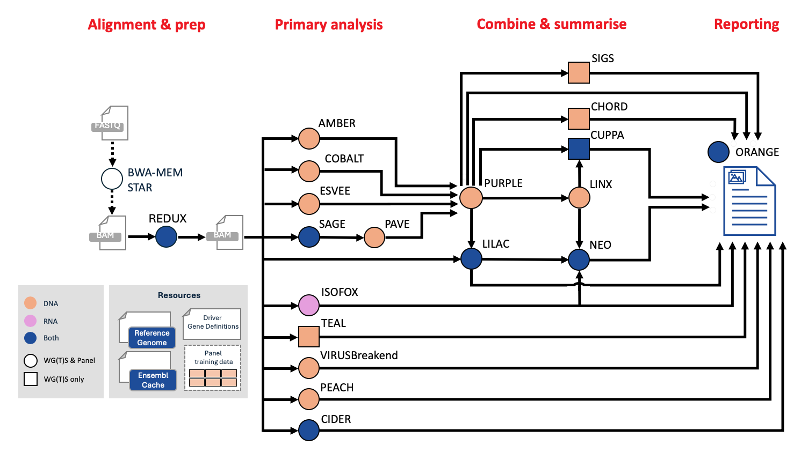

<h1>
  <picture>
    <source media="(prefers-color-scheme: dark)" srcset="docs/images/nf-core-oncoanalyser_logo_dark.png">
    
  </picture>
</h1>

[](https://github.com/nf-core/oncoanalyser/actions/workflows/ci.yml)
[](https://github.com/nf-core/oncoanalyser/actions/workflows/linting.yml)
[](https://nf-co.re/oncoanalyser/results)
[](https://doi.org/10.5281/zenodo.XXXXXXX)
[](https://www.nf-test.com)

[](https://www.nextflow.io/)
[](https://docs.conda.io/en/latest/)
[](https://www.docker.com/)
[](https://sylabs.io/docs/)
[](https://cloud.seqera.io/launch?pipeline=https://github.com/nf-core/oncoanalyser)

[](https://nfcore.slack.com/channels/oncoanalyser)
[](https://twitter.com/nf_core)
[](https://mstdn.science/@nf_core)
[](https://www.youtube.com/c/nf-core)

## Introduction

**nf-core/oncoanalyser** is a Nextflow pipeline for the analysis of Next Generation Sequencing (NGS) data using the
**[WiGiTS](https://github.com/hartwigmedical/hmftools)** toolkit of the Hartwig Medical Foundation (HMF).

### Supported sequencing methods

The pipeline is natively designed for analysing data from **whole genome sequencing (WGS)** and **whole transcriptome sequencing (WTS)**
data.

Oncoanalyser currently has built-in support for the
**[TSO500 panel](https://sapac.illumina.com/products/by-type/clinical-research-products/trusight-oncology-500.html)**.
For other **targeted panels** or **whole exome sequencing (WES)**, a training procedure (detailed [here](https://github.com/hartwigmedical/hmftools/blob/master/pipeline/README_TARGETED.md))
can be used to generate panel specific resources files allowing for normalisation of copy number, TMB, and TPM data as well as filtering of
panel specific artefacts.

### Input files

Onconalyser supports **BAM**, **CRAM** or **FASTQ** as starting inputs.

### Reference genomes

Oncoanalyser will work with most **GRCh37** and **GRCh38** genome builds.

We strongly recommend removing or masking all HLA class I alt contigs. These cause a myriad of issues in HLA class I genes including poor
small variant and copy number calling, as well as incorrect HLA typing. _We will soon release a standalone utility to remap HLA alt contigs
back to the original BAM for users who want to run from BAMs._

### Sample modes

Oncoanalyser supports **paired tumor/normal** (DNA sequencing only) or **tumor-only** (DNA and RNA sequencing) sample modes.

Paired tumor/normal is recommended if possible which allows for germline (normal) variants to be subtracted from tumor variants.

A paired tumor/normal mode with **donor sample** is also available for to allow multiple normal subtraction, which is relevant for patients
with bone marrow transplants or other known sample contamination in the tumor. This allows for germline subtraction from BAF points
(impacting purity fit) and from small variant calling.

## Pipeline summary

<p align="center"></p>

The pipeline mainly uses tools from **[WiGiTS](https://github.com/hartwigmedical/hmftools)**, as well as some external tools. Due to the
limitations of panel data, certain tools (mark with a caret `^` below) do not run in targeted mode.

- Read alignment: [BWA-MEM2](https://github.com/bwa-mem2/bwa-mem2) (for DNA), [STAR](https://github.com/alexdobin/STAR) (for RNA)
- Read post-processing: [REDUX](https://github.com/hartwigmedical/hmftools/tree/master/redux) (for DNA), [Picard MarkDuplicates](https://gatk.broadinstitute.org/hc/en-us/articles/360037052812-MarkDuplicates-Picard) (for RNA)
- SNV, MNV, INDEL calling: [SAGE](https://github.com/hartwigmedical/hmftools/tree/master/sage), [PAVE](https://github.com/hartwigmedical/hmftools/tree/master/pave)
- SV calling: [ESVEE](https://github.com/hartwigmedical/hmftools/tree/master/esvee)
- CNV calling: [AMBER](https://github.com/hartwigmedical/hmftools/tree/master/amber), [COBALT](https://github.com/hartwigmedical/hmftools/tree/master/cobalt), [PURPLE](https://github.com/hartwigmedical/hmftools/tree/master/purple)
- SV and driver event interpretation: [LINX](https://github.com/hartwigmedical/hmftools/tree/master/linx)
- RNA transcript analysis: [ISOFOX](https://github.com/hartwigmedical/hmftools/tree/master/isofox)
- Oncoviral detection: [VIRUSbreakend](https://github.com/PapenfussLab/gridss)^, [VirusInterpreter](https://github.com/hartwigmedical/hmftools/tree/master/virus-interpreter)^
- Immune analysis: [LILAC](https://github.com/hartwigmedical/hmftools/tree/master/lilac), [NEO](https://github.com/hartwigmedical/hmftools/tree/master/neo)^
- Mutational signature fitting: [SIGS](https://github.com/hartwigmedical/hmftools/tree/master/sigs)^
- HRD prediction: [CHORD](https://github.com/hartwigmedical/hmftools/tree/master/chord)^
- Tissue of origin prediction: [CUPPA](https://github.com/hartwigmedical/hmftools/tree/master/cuppa)^
- Summary report: [ORANGE](https://github.com/hartwigmedical/hmftools/tree/master/orange)

## Usage

> [!NOTE]
> If you are new to Nextflow and nf-core, please refer to [this page](https://nf-co.re/docs/usage/installation) on how to set up Nextflow.
> Make sure to [test your setup](https://nf-co.re/docs/usage/introduction#how-to-run-a-pipeline) with `-profile test` before running the
> workflow on actual data.

Create a sample sheet with your inputs (WGS/WTS BAMs in this example):

```shell
group_id,subject_id,sample_id,sample_type,sequence_type,filetype,filepath
PATIENT1_WGTS,PATIENT1,PATIENT1-T,tumor,dna,bam,/path/to/PATIENT1-T.dna.bam
PATIENT1_WGTS,PATIENT1,PATIENT1-R,normal,dna,bam,/path/to/PATIENT1-R.dna.bam
PATIENT1_WGTS,PATIENT1,PATIENT1-T-RNA,tumor,dna,bam,/path/to/PATIENT1-T.rna.bam
```

Launch `oncoanalyser`:

```bash
nextflow run nf-core/oncoanalyser \
  -profile <docker|singularity> \
  -revision 2.0.0 \
  --mode <wgts|targeted> \
  --genome <GRCh37_hmf|GRCh38_hmf> \
  --input sample_sheet.csv \
  --outdir output/
```

> [!WARNING]
> Please provide pipeline parameters via the CLI or Nextflow `-params-file` option. Custom config files including those provided by the `-c`
> Nextflow option can be used to provide any configuration _**except for parameters**_;
> see [docs](https://nf-co.re/usage/configuration#custom-configuration-files).

For more details and further functionality, please refer to the [usage documentation](https://nf-co.re/oncoanalyser/usage) and the
[parameter documentation](https://nf-co.re/oncoanalyser/parameters).

## Pipeline output

To see the results of an example test run with a full size dataset refer to the [results](https://nf-co.re/oncoanalyser/results) tab on the
nf-core website pipeline page. For more details about the output files and reports, please refer to the
[output documentation](https://nf-co.re/oncoanalyser/output).

## Credits

The Oncoanalyser pipeline was written by Stephen Watts while in the [Genomics Platform
Group](https://mdhs.unimelb.edu.au/centre-for-cancer-research/our-research/genomics-platform-group) at the [University
of Melbourne Centre for Cancer Research](https://mdhs.unimelb.edu.au/centre-for-cancer-research).

We thank the following organisations and people for their extensive assistance in the development of this pipeline,
listed in alphabetical order:

- [Hartwig Medical Foundation Australia](https://www.hartwigmedicalfoundation.nl/en/partnerships/hartwig-medical-foundation-australia/)
- Oliver Hofmann

## Contributions and Support

If you would like to contribute to this pipeline, please see the [contributing guidelines](.github/CONTRIBUTING.md).

For further information or help, don't hesitate to get in touch on the [Slack `#oncoanalyser`
channel](https://nfcore.slack.com/channels/oncoanalyser) (you can join with [this invite](https://nf-co.re/join/slack)).

## Citations

You can cite the Oncoanalyser zenodo record for a specific version using the following doi:
[10.5281/zenodo.XXXXXXX](https://doi.org/10.5281/zenodo.XXXXXXX)

An extensive list of references for the tools used by the pipeline can be found in the [`CITATIONS.md`](CITATIONS.md)
file.

You can cite the `nf-core` publication as follows:

> **The nf-core framework for community-curated bioinformatics pipelines.**
>
> Philip Ewels, Alexander Peltzer, Sven Fillinger, Harshil Patel, Johannes Alneberg, Andreas Wilm, Maxime Ulysse Garcia,
> Paolo Di Tommaso & Sven Nahnsen.
>
> _Nat Biotechnol._ 2020 Feb 13. doi: [10.1038/s41587-020-0439-x](https://dx.doi.org/10.1038/s41587-020-0439-x).
